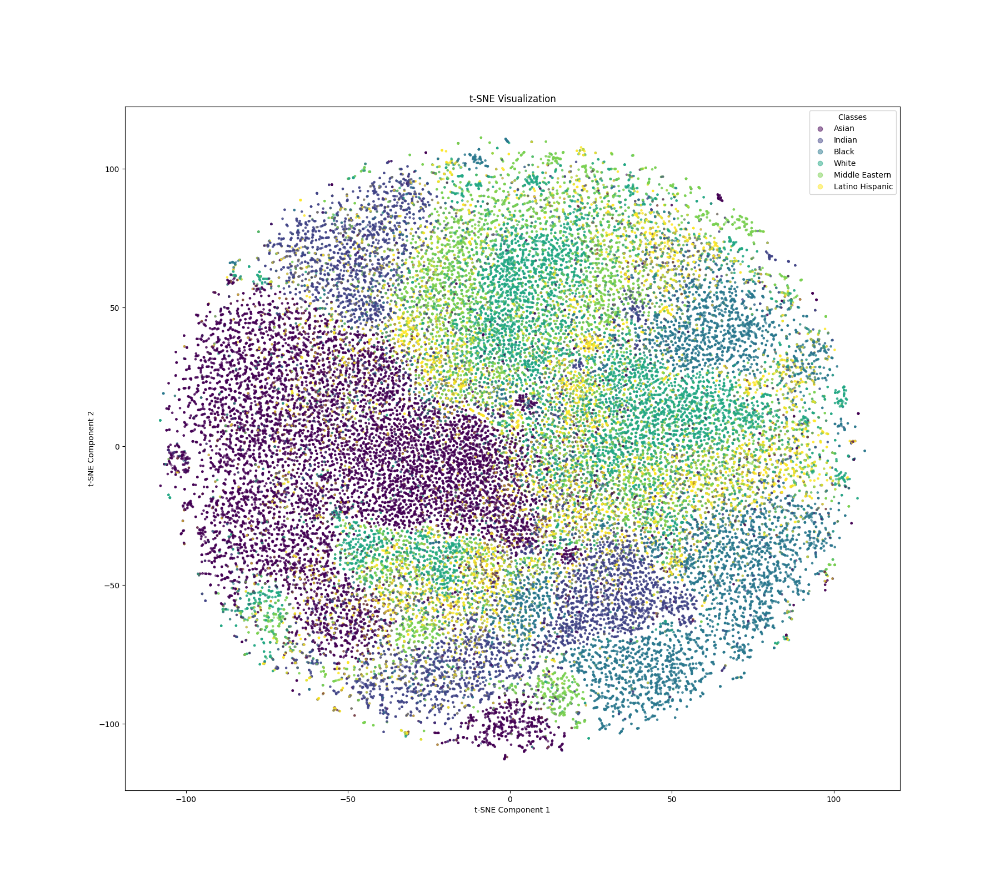
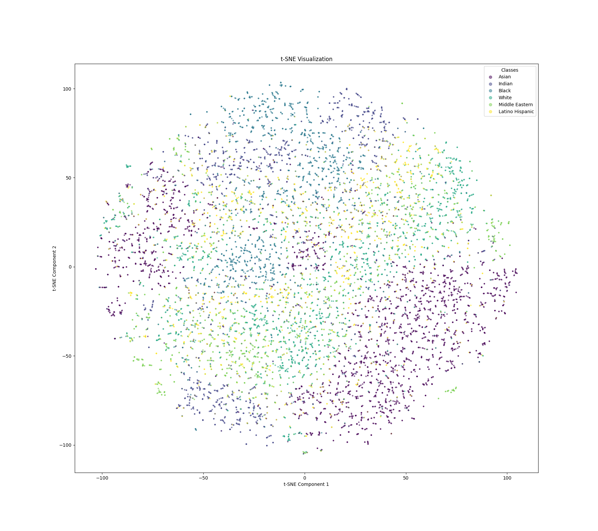
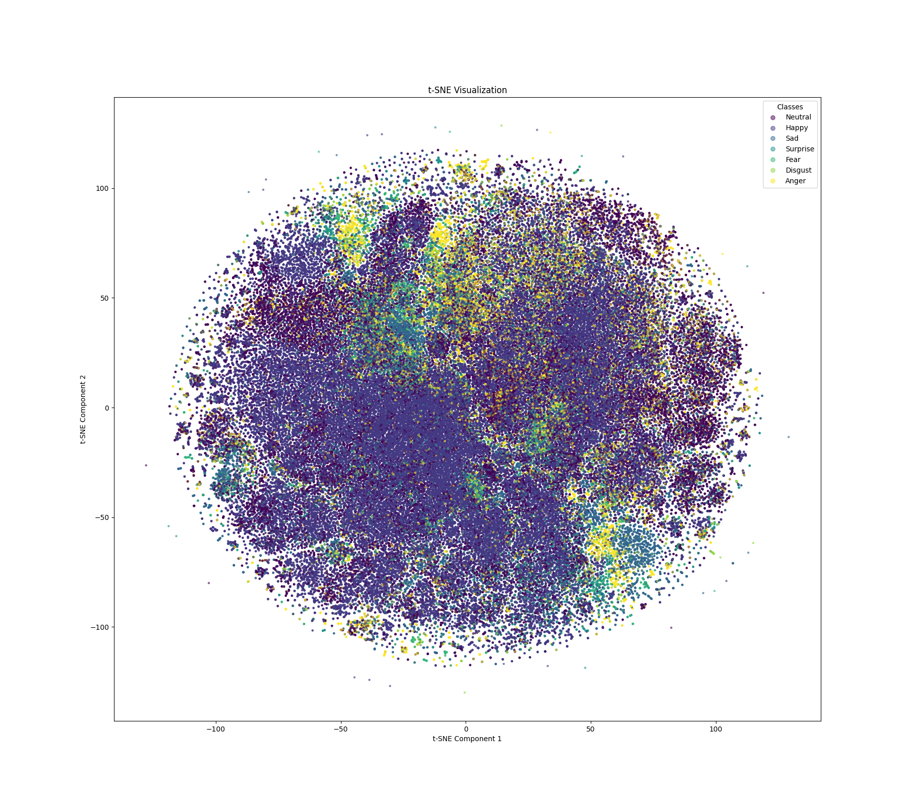
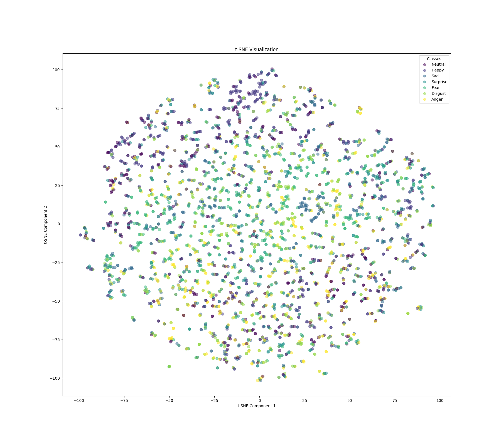

# Video-Diversity-Analysis

An end-to-end tool that allows the extraction and visualization of demography data like Age, Gender, Race and Emotion/Affect in an interactive dashboard with minimal intervention. 

## Prerequisites
After activating a virtual environment, run the following command:

`pip install -r requirements.txt`

Note: There may be issues with running deepface on GPU locally, try using Kaggle/Colab environments to run the notebooks/scripts. 

## Running the pipeline

Execute the following command to run the pipeline on a video file of your choice:

`python pipeline.py "path/to/video"` 

The dashboard of interactive visualizations should show up on : `http://127.0.0.1:8050`

## Demography Model Benchmarks

CLIP, LR+CLIP and Deepface are benchmarked on the AffectNet and FairFace datasets. Some experiments are also done to visualize the distribution of the data through t-SNE embeddings of the faces.

### Race prediction performance on FairFace Dataset

| Model           | Split      | Accuracy | Precision | Recall | F-Score (Weighted) | F-Score (Micro) | F-Score (Macro) |
|-----------------|------------|----------|-----------|--------|--------------------|----------------|----------------|
| **Deepface**    | Training   | 0.3770   | 0.3972    | 0.3770 | 0.3412             | 0.3770         | 0.3124         |
|                 | Validation | 0.3737   | 0.3970    | 0.3737 | 0.3404             | 0.3737         | 0.3102         |
| **CLIP Zero-Shot** | Training   | 0.5018   | 0.4953    | 0.5018 | 0.4347             | 0.5018         | 0.3947         |
|                 | Validation | 0.5083   | 0.5038    | 0.5083 | 0.4448             | 0.5083         | 0.4043         |
| **CLIP + LR**   | Training   | 0.7883   | 0.7860    | 0.7883 | 0.7869             | 0.7883         | 0.7672         |
|                 | Validation | 0.7886   | 0.7867    | 0.7886 | 0.7874             | 0.7886         | 0.7663         |

### Gender Prediction Performance on FairFace Dataset

| Model           | Split      | Accuracy | Precision | Recall | F-Score (Weighted) | F-Score (Micro) | F-Score (Macro) |
|-----------------|------------|----------|-----------|--------|--------------------|----------------|----------------|
| **Deepface**    | Training   | 0.7432   | 0.7624    | 0.7432 | 0.7349             | 0.7432         | 0.7315         |
|                 | Validation | 0.7408   | 0.7590    | 0.7408 | 0.7329             | 0.7408         | 0.7297         |
| **CLIP Zero-Shot** | Training   | 0.9491   | 0.9498    | 0.9491 | 0.9491             | 0.9491         | 0.9490         |
|                 | Validation | 0.9506   | 0.9512    | 0.9506 | 0.9506             | 0.9506         | 0.9505         |
| **CLIP + LR**   | Training   | 0.9604   | 0.9604    | 0.9604 | 0.9604             | 0.9604         | 0.9603         |
|                 | Validation | 0.9616   | 0.9616    | 0.9616 | 0.9616             | 0.9616         | 0.9615         |

### Emotional Expression Prediction Performance on AffectNet Dataset

| Model           | Split      | Accuracy | Precision | Recall | F-Score (Weighted) | F-Score (Micro) | F-Score (Macro) |
|-----------------|------------|----------|-----------|--------|--------------------|----------------|----------------|
| **Deepface**    | Training   | 0.5436   | 0.5754    | 0.5436 | 0.5553             | 0.5436         | 0.3014         |
|                 | Validation | 0.3234   | 0.3418    | 0.3234 | 0.2853             | 0.3234         | 0.2853         |
| **CLIP Zero-Shot** | Training   | 0.4440   | 0.5904    | 0.4440 | 0.4948             | 0.4440         | 0.2821         |
|                 | Validation | 0.3477   | 0.3928    | 0.3477 | 0.3363             | 0.3477         | 0.3363         |
| **CLIP + LR**   | Training   | 0.7628   | 0.7570    | 0.7628 | 0.7529             | 0.7628         | 0.5464         |
|                 | Validation | 0.4869   | 0.5881    | 0.4869 | 0.4548             | 0.4869         | 0.4548         |

## t-SNE Visualization of CLIP embeddings 

### t-SNE on FairFace Training Split

### t-SNE on FairFace Validation Split

### t-SNE on AffectNet Training Split

### t-SNE on AffectNet Validation Split

## Notes
I am aware of the poor project structure. Since this is a work in progress and is primarily for my dissertation, there will be a complete re-organization of the files following good practices after my deadline. Cheers!